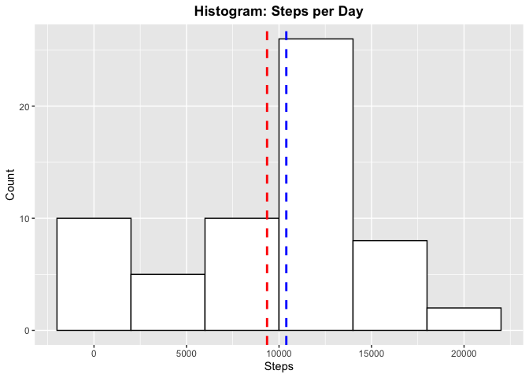
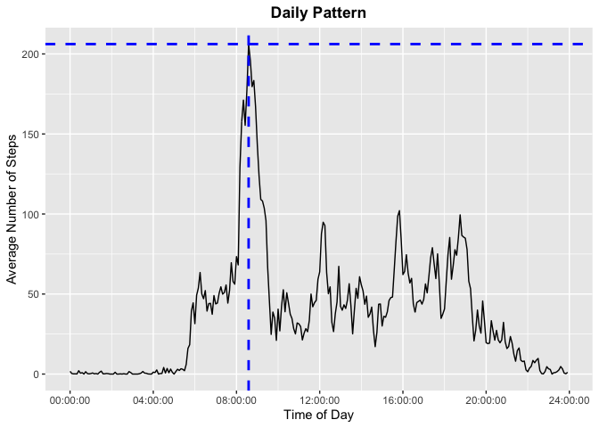
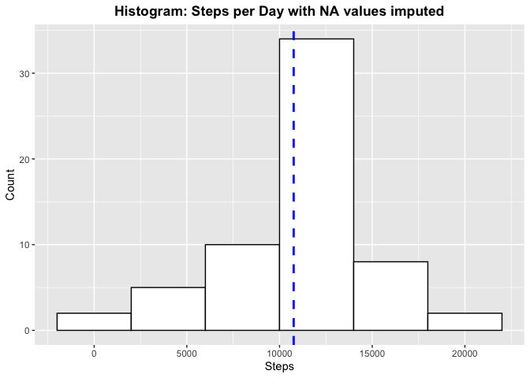
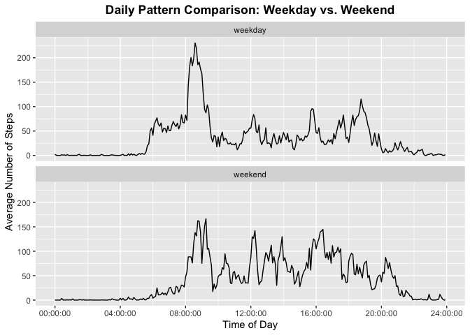

## Libraries used in this report for processing the data:


```r
library(dplyr)
library(ggplot2)
library(hms)
library(stringr)
```


## Loading and preprocessing the data

Data from the personal activity monitoring device is stored in the file *"activity.zip"*. This compressed file contains the data file *"activity.csv"* in comma-separated-value.


The following code uncompresses the file and reads the data into the *activity* data-frame. The output of *read.csv* is converted to a tibble using *as.tibble*, for use with the *dplyr* package. The variables *interval* and *date* are converted into factors.


```r
unzip("activity.zip")
activity <- as_tibble(read.csv("activity.csv"))
activity <- mutate(activity,interval=as.factor(interval), date=as.factor(date))
```

The structure of *activity* is:


```r
str(activity)
```

```
## tibble [17,568 × 3] (S3: tbl_df/tbl/data.frame)
##  $ steps   : int [1:17568] NA NA NA NA NA NA NA NA NA NA ...
##  $ date    : Factor w/ 61 levels "2012-10-01","2012-10-02",..: 1 1 1 1 1 1 1 1 1 1 ...
##  $ interval: Factor w/ 288 levels "0","5","10","15",..: 1 2 3 4 5 6 7 8 9 10 ...
```

[Note: This fulfills part *1. Code for reading in the dataset and/or processing the data*]


## What is mean total number of steps taken per day?

To calculate this, the *activity* data is grouped by *date* and the result is 
summarized by calculating the total steps in each day.


```r
perDay<-activity %>% 
        group_by(date) %>% 
        summarize(total=sum(steps,na.rm=TRUE)) 
str(perDay)
```

```
## tibble [61 × 2] (S3: tbl_df/tbl/data.frame)
##  $ date : Factor w/ 61 levels "2012-10-01","2012-10-02",..: 1 2 3 4 5 6 7 8 9 10 ...
##  $ total: int [1:61] 0 126 11352 12116 13294 15420 11015 0 12811 9900 ...
```
The *perDay* data is presented as a histogram below. The dashed blue line indicates the median total number of steps per day, the red line indicates the mean value.


```r
ggplot(perDay, aes(x=total)) + 
        geom_histogram(binwidth=4000,color="black", fill="white") +
        geom_vline(aes(xintercept=median(total)),color="blue", 
                   linetype="dashed", size=1) +
        geom_vline(aes(xintercept=mean(total)),color="red", 
                   linetype="dashed", size=1) +
        labs(title="Histogram: Steps per Day",x="Steps", y = "Count") +
        theme(plot.title=element_text(face="bold",hjust = 0.5))
```

<!-- -->

[Note: This fulfills part *2. Histogram of the total number of steps taken each day*

Below, we calculate the "five-number" summary of *perDay*:


```r
print(perDaySummary <- summary(perDay$total))
```

```
##    Min. 1st Qu.  Median    Mean 3rd Qu.    Max. 
##       0    6778   10395    9354   12811   21194
```

The mean number of steps per day is
**9354.23**
and the median is 
**10395.00**.

[Note: This fulfills part *3. Mean and median number of steps taken each day*]

## What is the average daily activity pattern?

The daily activity pattern can be discerned by calculating the average for
each *interval*.  This is accomplished by the following code:


```r
dailyPattern <-activity %>% 
        group_by(interval) %>% 
        summarize(mean=mean(steps, na.rm=TRUE))
str(dailyPattern)
```

```
## tibble [288 × 2] (S3: tbl_df/tbl/data.frame)
##  $ interval: Factor w/ 288 levels "0","5","10","15",..: 1 2 3 4 5 6 7 8 9 10 ...
##  $ mean    : num [1:288] 1.717 0.3396 0.1321 0.1509 0.0755 ...
```

To plot the data appropriately, the *interval* variable needs to be converted to 
a time
class (otherwise, there is a jump from 0059 to 100, from 159 to 200, etc.) THe
following code accomplishes this conversion, storing the data in the *time*
column:


```r
padInterval <- str_pad(dailyPattern$interval,4,pad="0")
colonInterval <- paste0(substr(padInterval,1,2),":",
                           substr(padInterval,3,4))
dailyPattern$time <- parse_hm(colonInterval)
str(dailyPattern$time)
```

```
##  'hms' num [1:288] 00:00:00 00:05:00 00:10:00 00:15:00 ...
##  - attr(*, "units")= chr "secs"
```

Now, we can plot the data. The blue lines indicate the maximum average number
of steps, and the interval when this occurs:


```r
maxMean <- max(dailyPattern$mean)
maxMeanIndex <-which(dailyPattern$mean == maxMean)
print(as.character(maxMeanInterval <-dailyPattern$interval[maxMeanIndex]))
```

```
## [1] "835"
```

```r
maxMeanTime <-dailyPattern$time[maxMeanIndex]

ggplot(dailyPattern, aes(x=time, y=mean))+
        geom_line() +
        geom_hline(aes(yintercept=maxMean),color="blue", 
                       linetype="dashed", size=1) +
        geom_vline(aes(xintercept=maxMeanTime),color="blue", 
                      linetype="dashed", size=1) +
        labs(title="Daily Pattern",x="Time of Day", 
             y = "Average Number of Steps") +
        theme(plot.title=element_text(face="bold",hjust = 0.5))+
        scale_x_time(breaks = seq(hms::hms(0,0,0), by = hms(0,0,4), 
                                  length.out = 7))
```

<!-- -->

[Note: This fulfills part *4. Time series plot of the average number of steps taken*]

The maximum average number of steps in a five minute interval is 
**206.17**, and this occurs in *interval* **835**.

[Note: this fulfills part *5. The 5-minute interval that, on average, contains 
the maximum number of steps*]

## Imputing missing values

There are a number of days/intervals where there are missing values (coded as 
NA). The presence of missing days may introduce bias into some calculations or 
summaries of the data presented above.

The following code calculates and reports the total number of missing values in 
the dataset (i.e. the total number of rows with NAs)


```r
print(numberOfNA <- sum(is.na(activity$steps)))
```

```
## [1] 2304
```

There are **2304** missing values (*NA*'s) in the *steps* variable.

To fill in all of the missing values in the dataset, I will use the **rounded 
daily mean pattern** *dailyPattern* calculated above. 
The result is be stored in a new column *imputedSteps* of *activity*. 
This is accomplished by the following code:


```r
activity <- tibble::add_column(activity,imputedSteps = 0)
for (index in 1:nrow(activity)) {
        if(is.na(activity$steps[index])) 
                activity$imputedSteps[index] <- 
                        round(dailyPattern$mean
                              [  which(dailyPattern$interval == 
                                               activity$interval[index])  ],0)
        else activity$imputedSteps[index] <- activity$steps[index]
}
str(activity$imputedSteps)
```

```
##  num [1:17568] 2 0 0 0 0 2 1 1 0 1 ...
```

[Note: this fulfills part *6. Code to describe and show a strategy for imputing missing data*]

Using these imputed values, I can now recreate the per-day summary, *perDayImputed*, 
and replot the histogram for the total number of steps per day:


```r
perDayImputed<-activity %>%
        group_by(date) %>% 
        summarize(total=sum(imputedSteps))
str(perDayImputed)
```

```
## tibble [61 × 2] (S3: tbl_df/tbl/data.frame)
##  $ date : Factor w/ 61 levels "2012-10-01","2012-10-02",..: 1 2 3 4 5 6 7 8 9 10 ...
##  $ total: num [1:61] 10762 126 11352 12116 13294 ...
```

```r
ggplot(perDayImputed, aes(x=total)) + 
        geom_histogram(binwidth=4000,color="black", fill="white") +
        geom_vline(aes(xintercept=median(total)),color="blue", 
                   linetype="dashed", size=1) +
        labs(title="Histogram: Steps per Day with NA values imputed",x="Steps", 
             y = "Count") +
        theme(plot.title=element_text(face="bold",hjust = 0.5))
```

<!-- -->

[Note: this fulfills part *7.Histogram of the total number of steps taken each 
day after missing values are imputed*]

Below, we re=calculate the "five-number" summary of *perDayImputed*:


```r
print(perDayImputedSummary <- summary(perDayImputed$total))
```

```
##    Min. 1st Qu.  Median    Mean 3rd Qu.    Max. 
##      41    9819   10762   10766   12811   21194
```

The new calculated mean number of steps per day value is
**10765.64**
and the median is 
**10762.00**. With the addition of
the imputed values, the mean and the median now almost coincide.  In addition, the
results shifted to higher values because replacing the *NA*'s with average values 
eliminated several days with "zero steps."

## Are there differences in activity patterns between weekdays and weekends?

To compare the behavior during weekdays vs. weekends, I created a new factor 
variable in the dataset with two levels – “weekday” and “weekend” 
indicating whether a given date is a weekday or weekend day. This is stored
in the variable *type*.


```r
weekends <- c("Saturday","Sunday")
activity <- tibble::add_column(activity,
                               type = as.factor(
                                       ifelse(weekdays(as.Date(activity$date)) 
                                              %in% weekends,"weekend","weekday")))
```

The daily activity patterns for weekdays and weekends can be discerned by 
calculating the average for each *type* and *interval*.  This is accomplished 
by the following code:


```r
dailyPatternWeek <-activity %>% 
        group_by(type,interval) %>% 
        summarize(mean=mean(imputedSteps))
```

The figure below compares the **weekday** and the **weekend** patterns:


```r
padInterval <- str_pad(dailyPatternWeek$interval,4,pad="0")
colonInterval <- paste0(substr(padInterval,1,2),":",
                        substr(padInterval,3,4))
dailyPatternWeek$time <- parse_hm(colonInterval)

ggplot(dailyPatternWeek, aes(x=time, y=mean))+
        geom_line() +
        facet_wrap(~ type, nrow=2, ncol=1) +
        labs(title="Daily Pattern Comparison: Weekday vs. Weekend",x="Time of Day", 
             y = "Average Number of Steps") +
        theme(plot.title=element_text(face="bold",hjust = 0.5))+
        scale_x_time(breaks = seq(hms::hms(0,0,0), by = hms(0,0,4), 
                                  length.out = 7))
```

<!-- -->

[Note: This fulfills part *8. Panel plot comparing the average number of steps 
taken per 5-minute interval across weekdays and weekends*]

The pattern appears different in weekdays compared to weekends:

* During weekdays, there appears to be one long walk or run in the moring hours, but
litte activity afterward (less than 100 steps per 5 minute interval).  
* In weekends, there is activity in the morning hours as during weekdays, but
there is additional moderate activity throughout the day (more than 100
steps per interval.)

**[ Note: All of the R code needed to reproduce the results (numbers, plots, etc.) 
in this report is included, in fulfillment of Part 8.]**


